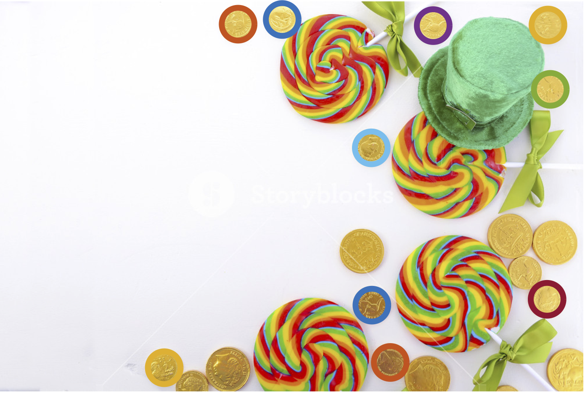

# Circle Detection

This repository contains simple MATLAB implementations for circle detection using the [Hough
Transformation](https://en.wikipedia.org/wiki/Hough_transform) or the [Random Sample consensus
RANSAC](https://en.wikipedia.org/wiki/Random_sample_consensus) algorithm.
The algorithms take an image and a fixed (known) radius as an input, and return the centers of any detected circles of 
about that size.
In the [data](data) folder, you can find images to test the algorithms with. 
<br><br>

## How does it work?

### Hough Transform

In my Matlab code, you can find two different solutions using two different approaches. They differ in terms of how they iterate, 
and how they determine local maxima. Hyperparameters like bin size, threshold or settings of the Canny edge detector have to be set 
for every model individually. In the beginning, both change the image to a greyscale image and use the Canny edge detector to compute the edges. 
After that we determine the x and y values where edges can be found.

(1.1) The first approach then iterates over those x and y values, and for each gradient direction (th=1:360), it computes
```
a = r + x(i) + round(r ∗ cos(th ∗ pi/180))
b = r + y(i) − round(r ∗ sin(th ∗ pi/180)) (1)
H(a, b) = H(a, b) + 1
```
where H is the Hough space, and r is the radius. 
This step is called voting; more votes imply a greater probability of a point being a center. 
After that, reshaping the matrix is done to ensure that parts of circles are not outside of the image. 
Thresholding is done by dropping every vote below a specified threshold. All other points are considered as centers. 
To make sure there are no duplicates for the same circle, the algorithm deletes centers which are too ’close’ to each other 
(in code: threshold multiple) using the l2-norm.
In brief, the l2 norm is calculated for neighboring pixels, and if the distance is below a specific threshold, the duplicate is deleted. A Hough space
visualization can be seen below.
<br><br>
<p align="center">
   
</p>
<br><br>

(1.2) Similarly to (1.1), solution2 iterates over those x and y values, and for each gradient direction (th=1:360), it computes
```
a = x(i) + round(r ∗ cos(th ∗ pi/180))
b = y(i) + round(r ∗ sin(th ∗ pi/180)) (2)
H(b, a) = H(b, a) + 1,
```
where H is the Hough space, and r is the radius. 
For processing the votes, local maxima in the accumulator space (Hough space) are found 
by iterating over each bin matrix. A bin matrix in the 2D space is a window which is shifted after each iteration by a bin size. 
The index of the local maxima is computed and the row and column index containing 
the equivalent row and column subscripts corresponding to the maximum index for the bin matrix are determined. The sum of all values in 
the bin matrix is computed, and saved in the position of the local maxima (using the indexes calculated above). 
The changed bin matrix is saved in the matrix called result, which is the updated accumulator space containing the local maxima votes. 
The window is shifted to the left and the iteration continues, till we reach the left side 
(then we shift up and go to the right side of the matrix again), or the top of the matrix (then we terminate the algorithm). 
Parameters with the ’most’ votes (also determined by a threshold) indicate circles in the image. 
Therefore, thresholding like mentioned in (1.1) is used, all non-zero values are detected and the xy coordinates of the pixels are saved in centers. 
Alternatively, adapative thresholding can be done by first determining the maximum local maxima value, scaling it down, 
and then using this values as your threshold.

### RANSAC
In the beginning, both change the image to a greyscale image and use the Canny edge detector to compute the edges. 
After that we determine the x and y values where edges can be found. 
For a specific amount of iterations, the following steps are repeated:<br>
(i) We randomly select two edge pixels and determine their distance by computing the l2-norm, 
till we find pixels within a desired distance (param- eters can differ between implementations; 
the distance should be around the diameter (meaning 2*radius) of our desired circle). The center 
between the xy coordinates is saved (in out in this case). The computed center is considered a potential center of a circle.<br>
(ii) Looping over all edge pixels, we determine the distance (l2-norm) between each edge pixel and the computed (out-) 
pixel from (i). If the distance is in a specific boundary around the radius (also called the donut region), 
the edge pixel is considered an inlier and the counter num in increases by 1. A visualization of the terminologies can be seen below.
<br><br>
<p align="center">
   
</p>
<br><br>
(iii) If the amount of inliers for the (out-) 
pixel is above a predefined threshold, the (out-) pixel is considered a center and saved in the center matrix.
These iterations are repeated multiple times to get the best fitting model. This is done by summing up the number of inliers
for all detected circles. In case the number of inliers for an epoch is higher than the best model so far, the new best model 
is saved. Duplicates are deleted like in (1.a Hough Transform), and the centers are returned. This algorithm can be optimized 
by using Adaptive RANSAC, or optimizing the boundary settings by an extensive hyperparameter search.

## Differences between the algorithms

One advantage is that RANSAC separates the observed data into inliers and outliers and therefore is more robust 
regarding outliers, while Hough transform can be affected by noisy edge points for example. Furthermore, RANSAC 
can be used iteratively to obtain multiple models, resulting in a more robust algorithmic solution. However, 
RANSAC does not always give accurate results since it is based on randomness. RANSAC is applicable for a larger 
number of model parameters than Hough transform. In addition, optimization parameters are easier to choose than 
Hough transform. RANSAC is computationally more efficient.

## Result

Below you can see an example of how the algorithm detects certain coins given a radius, and displays them.
<br><br>
<p align="center">
   
</p>